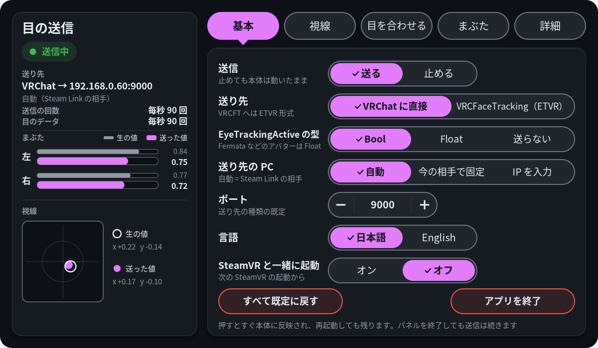
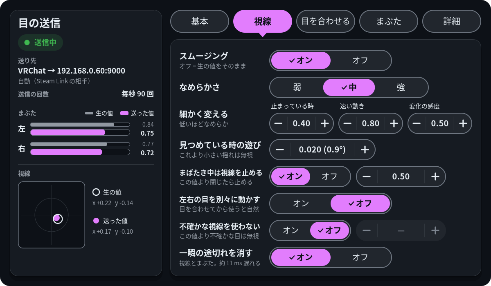
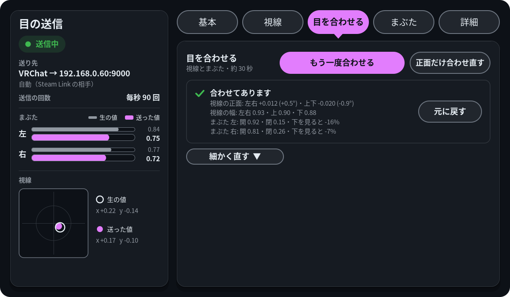
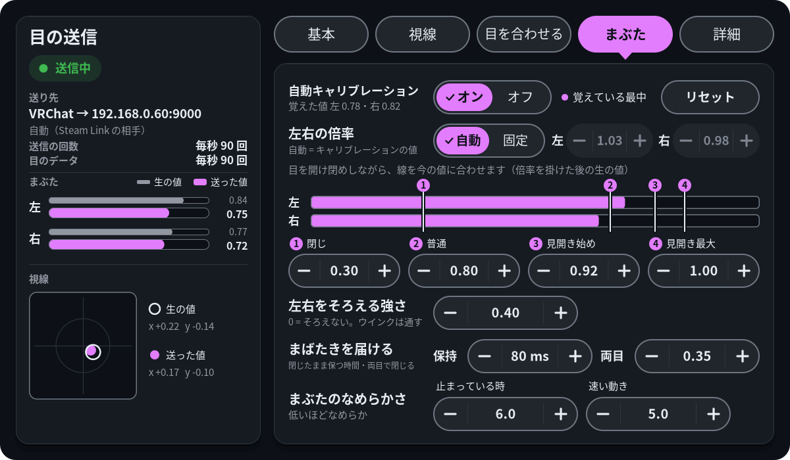
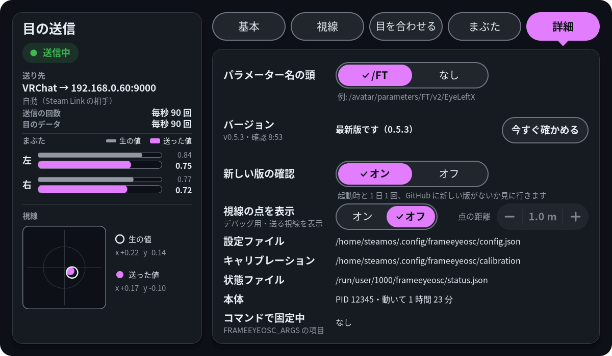

# frameeyeosc

Steam Frame のアイトラッキング（視線とまぶたの開き具合）を、VRCFaceTracking 形式のアバターパラメータとして OSC で VRChat に送るツールです。ヘッドセット上でバックグラウンドのサービスとして動き、Steam Link でストリーミングしている PC 版 VRChat で使えます。PC の VRCFaceTracking に送って、ほかのトラッカーとまとめることもできます。

[English](README.md)

https://github.com/user-attachments/assets/f8969485-161b-40d4-b9e4-689dee6d1955

[konsti219/frameeyeosc](https://github.com/konsti219/frameeyeosc) をフォークしたものです。Steam Frame のまぶたのデータは公開 API からは取れないのですが、元のプロジェクトが内部の共有メモリ（`/dev/shm/eye-server.mmap`）から読めることを見つけてくれたおかげで、このツールを作ることができました。

## このフォークで足したもの

- 送り先の PC は自動で見つけます。Steam Link でつないでいる PC に送るので、アドレスを調べて設定する必要はありません。付属の無線アダプタを使っているときはその直通回線で送るので、家のネットワークの状態にも左右されません
- 視線とまぶたを One Euro フィルタでなめらかにしています。何かを見つめているときの細かい揺れは小さなデッドゾーンで止め、目を閉じている間は視線を固定します。Frame は目を開けた瞬間に視線が跳ねるためです
- 両目に同じ視線を送ります。Frame は左右の目の視線がそれぞれ勝手に揺れるので、そのまま送るとアバターの目がピクピクします。左右別々にしたいときは `--independent-eyes` を付けてください
- まぶたの値を VRCFT の基準（0 で閉じる、0.75 で普通、1 で見開き）に合わせています。Frame の値は、目を閉じ続けても 0.2 前後までしか下がらず、普通に開いているときも 0.75〜0.9 くらいでふらつきます
- まぶたは使っているうちに自動で調整されます。左右それぞれの普段の開き具合を覚えるので、顔や被り方のせいで片目だけ開いて見える人でも、アバターでは揃って見えます。ウインクはそのまま伝わります
- サービスとして常駐し、SteamVR と一緒に起動します。止まっても自動で再起動します
- 設定はファイルに置き、動いたまま反映します。SteamVR のダッシュボードに出すパネル（入れなくてもよい）で、被ったまま変えられます
- VRCFaceTracking 用の ETVR Tracking Module が読む形式でも送れます（[VRCFaceTracking（ETVR）モード](#vrcfacetrackingetvrモード)）

## 必要なもの

- 開発者モードを有効にして SSH で入れる Steam Frame（設定 → システム → 開発者モードを有効化、開発者の項目でパスワードを設定）。SSH を有効にすると、同じネットワークにいてパスワードを知っている人は誰でもヘッドセットに入れるので、推測されにくいパスワードにしてください
- Steam Link でストリーミングしている PC 版 VRChat（Action Menu → Options → OSC → Enabled）
- VRCFaceTracking の目のパラメータ（`FT/v2/EyeLeftX`、`EyeLidLeft` など）を float で持つアバター。VRChat に直接送るときは、パラメータをビットに詰める「バイナリパラメータ」のアバターには対応していません
- VRCFaceTracking（ETVR）モードで使うときは、PC に VRCFaceTracking と ETVR Tracking Module

## インストール

リリースページから tar.gz をダウンロードして、ヘッドセットにコピーします。PC からなら例えば:

```sh
scp frameeyeosc-*-steamframe-aarch64.tar.gz steamos@<ヘッドセットのIP>:
```

そのあとヘッドセット上で（`ssh steamos@<ヘッドセットのIP>`）:

```sh
tar xzf frameeyeosc-*-steamframe-aarch64.tar.gz
cd frameeyeosc
./install.sh               # frameeyeosc だけ
./install.sh --with-panel  # frameeyeosc とダッシュボードのパネル
```

sudo は要りません。全部ホームフォルダ（`~/.local/bin`、`~/.config`、`~/.local/share`）に入るので、SteamOS を更新しても消えません。更新するときも同じコマンドです。`--with-panel` を付けないときは、入っているパネルはそのまま残ります。

インストールしたら、PC 側で Steam Link の OSC 送信を OFF にしてください（SteamVR の設定 → Steam Link → OSC）。Steam Link もスムージングなしの目のデータを VRChat に送っているので、両方が動いているとアバターの目を2つのデータが取り合ってしまいます。ETVR モードでも同じです（アバターの目を動かすのが VRCFaceTracking になるだけです）。

### 0.4.0 より前の版から更新するとき

0.4.0 より前の版には更新の仕組みがないので、0.4.0 へは一度だけ手で更新します。新しい tar.gz を上と同じ手順でコピーして広げ、`./install.sh --with-panel`（パネルがいらなければ `./install.sh`）を実行するだけです。`~/.config/frameeyeosc/env` と学習したまぶたの値はそのまま使われ、サービスも新しい版で起動し直します。

`env` の `FRAMEEYEOSC_ARGS` に書いたオプションは、今までどおり効きます。ただし、そこに書いた項目はパネルでは「コマンドで固定中」になって変えられません。パネルで変えたい項目は `env` から消して、`systemctl --user restart frameeyeosc` してください（値はパネルで設定し直します）。

削除は `./install.sh --uninstall`（パネルも消えます。設定と学習値も消すなら `--purge` を付ける）。

### パネルから更新する（0.4.0 から）

0.4.0 からは、パネルの「更新する」で更新できます。パネルの「詳細」に、入っている版が出ます。パネルは起動時と、その後 1 日 1 回まで、GitHub に新しい版がないか確かめます。1 日 1 回なのは確認がうまくいっている間で、失敗したときは 1 時間後にもう一度確かめます。「今すぐ確かめる」を押すとその場で確かめます。新しい版があれば「更新する」で、ダウンロードしてリリースの `SHA256SUMS` と照らし合わせ、前回と同じオプション（`~/.config/frameeyeosc/install-args` に残っています）でその `install.sh` を実行します。本体とパネルは新しい版で起動し直します。`install.sh` を実行する前に失敗したときは何も変わりません。ログは `~/.cache/frameeyeosc/update.log` です。毎日の確認は「新しい版の確認」をオフにすると止まります（「今すぐ確かめる」は使えます）。更新そのものは、ボタンを押したときにしか行いません。

`SHA256SUMS` は同じリリースに付いているチェックサムで、署名ではありません。ダウンロードが壊れていたり途中で切れていたりするのは見つけられますが、GitHub 上でリリースごと差し替えられたものは見つけられません（チェックサムも一緒に差し替わるため）。

## パネル

`./install.sh --with-panel` で、SteamVR のダッシュボードに「Eye」のパネルが入ります。次に SteamVR を起動したときから一緒に起動します。すぐ開きたいときは、ダッシュボードの「プログラムを起動」（＋）から「frameeyeosc パネル」を選んでください。

| 基本 | 視線 |
|---|---|
|  |  |
| **目を合わせる** | **まぶた** |
|  |  |
| **詳細** | |
|  | |

- 左の列には、いつでも今の状態が出ます: 送信中か止めているか、送り先、毎秒の送信回数、左右のまぶたと視線（生の値と送った値）、設定のエラー
- 基本: 送信の一時停止、VRChat か VRCFaceTracking（ETVR）か、送り先の PC（自動か、今送っている PC で固定。VR の中で IP を打たなくて済みます）、ポート、言語（日本語 / English）、SteamVR と一緒に起動、すべて既定に戻す、アプリを終了
- 視線: スムージングのオン / オフ、なめらかさの弱 / 中 / 強と 3 つの値、見つめている時の遊び、まばたき中は視線を止める、左右の目を別々に動かす、不確かな視線を使わない、一瞬の途切れを消す
- 目を合わせる: ボタン 1 つで視線とまぶたを約 30 秒で合わせる（[目を合わせる](#目を合わせる) を参照）、正面だけ合わせ直す、結果と［元に戻す］、「細かく直す」の中で値を手で直す
- まぶた: 自動キャリブレーションと覚えた値、左右の倍率、左右の今の開き具合の上に重ねた 4 つの目盛り（目を閉じたり見開いたりしながら合わせる）、左右をそろえる強さ、まばたきを届ける（閉じたまま保つ時間・両目で閉じる）、まぶたのなめらかさ
- 詳細: パラメーター名の頭、版の表示と更新の確認・更新、ファイルの場所、コマンドで固定中の項目

パネルは `config.json` を書き、状態ファイルを読みます。既定の言語を決めるために、起動時に 1 回だけ Steam の `~/.steam/registry.vdf` の `language` の行も読みます（読むだけ）。更新には `~/.local/share/frameeyeosc/frame-update.sh` を使います（上を参照）。閉じても、終了しても、入れていなくても frameeyeosc は送り続けます。ダッシュボードで開いていない間は何も描きません。そのとき読むのは、更新の確認を動かすほかは、更新の状態ファイル（`~/.cache/frameeyeosc/update-state.json`）を 1 秒に 2 回ほどだけです。ただし目を合わせている間は、終わるまで状態ファイルも読み、ダッシュボードを閉じた状態で点を出します。「SteamVR と一緒に起動」は、パネルの systemd ユーザーサービス（`frameeyeosc-panel.service`）を有効 / 無効にします。ビルド方法や確認用のオプションは [panel/README.md](panel/README.md) にあります。

## 設定

設定は `~/.config/frameeyeosc/config.json` にあります。パネルが書きますが、手で書いてもかまいません。frameeyeosc は 1 秒ごとにこのファイルを見て、変わっていたら再起動せずに反映します。書いていない項目は既定値、知らない項目は無視します。ファイルが壊れていたり値が範囲外だったりしたときは、前の設定のまま動き続け、エラーを出します（パネルと状態ファイルに出ます）。

```json
{ "output": "vrchat", "gaze_min_cutoff": 0.3, "lid_sync": 0.6 }
```

| キー | オプション | 既定値 | 内容 |
|---|---|---|---|
| `sending` | | `true` | `false` で送信を一時停止（VRChat モードでは `EyeTrackingActive=false` を 1 回送る） |
| `output` | `--output` | `"vrchat"` | `"vrchat"` は VRChat にアバターパラメータを送る、`"etvr"` は VRCFaceTracking の ETVR Tracking Module に送る |
| `host` | `--target` | `"auto"` | `"auto"` は Steam Link の接続先 PC。それ以外は IP アドレスかホスト名（ポートは付けない） |
| `port` | `--port`、`--target` | `null` | `null` は `vrchat` なら 9000、`etvr` なら 8889 |
| `prefix` | `--prefix` | `"/FT"` | パラメータ名の頭。`""` で頭なし |
| `raw` | `--raw` | `false` | スムージングしない。時間を使う処理（途切れ消し、視線を止める、品質チェック、閉じたまま保つ、真下で左右を止める）もしない |
| `gaze_min_cutoff` | `--gaze-min-cutoff` | `0.4` | 下げるほど止まっている時の視線が安定（その分遅れる） |
| `gaze_beta` | `--gaze-beta` | `0.8` | 上げるほど素早い視線の動きに遅れず付いていく |
| `gaze_d_cutoff` | `--gaze-d-cutoff` | `0.5` | 下げるほど、トラッキングのノイズで視線のフィルタがゆるみにくい |
| `gaze_deadzone` | `--gaze-deadzone` | `0.02` | これより小さい視線の変化は無視（1.0＝45°） |
| `gaze_hold_below` | `--gaze-hold-below` | `0.5` | どちらかの目の開き具合がこれより小さい間は視線を止める。`0` で無効 |
| `independent_eyes` | `--independent-eyes` | `false` | 共通の視線ではなく、左右それぞれの視線を送る。目を合わせると目ごとの左右も合うので、自然に見える |
| `gaze_quality_limit` | `--gaze-quality-limit` | `0`（オフ） | 念のための安全策: Frame が出す視線の不確かさ（共分散）がこれ（例: `0.03`）より大きい目の視線は使わない。片目だけならもう片方の目で両目を動かし、両目ともなら視線を止める。まぶたには影響しない。きちんと合ったヘッドセットでは測って差が出なかった。不確かさが上がるのはほぼ目を閉じかけている間だけで、そこは `gaze_hold_below` がもう視線を止めているため |
| `despike` | `--no-despike` | `true` | 視線と開き具合の 1 サンプルだけの途切れを消す（3 サンプルの中央値。全体が約 11 ms 遅れる） |
| `lid_min_cutoff` / `lid_beta` | `--lid-min-cutoff` / `--lid-beta` | `6.0` / `5.0` | まぶたのなめらかさ（視線と同じ考え方） |
| `lid_closed` / `lid_open` / `lid_widen_start` / `lid_wide` | `--lid-closed` など | `0.30` / `0.80` / `0.92` / `1.00` | Frame の開き具合を「閉じ／普通／見開き」にどう対応させるか |
| `lid_scale_left` / `lid_scale_right` | `--lid-scale-left` / `--lid-scale-right` | `null`（学習値） | 学習値の代わりに固定の倍率を使う |
| `lid_calibration` | `--no-lid-calibration` | `true` | まぶたを学習する |
| `lid_sync` | `--lid-sync` | `0.4` | 左右のまぶたの小さな差を揃える。大きな差（ウインク）はそのまま。`0` で無効 |
| `blink_hold_ms` | `--blink-hold-ms` | `80` | 目が閉じたら、少なくともこの時間は完全に閉じた値を送る。短いまばたきもほかの人に届くように。`0` で無効 |
| `blink_sync_below` | `--blink-sync-below` | `0.35` | 片目が閉じていて、もう片方がこれより小さい（VRCFT の値）とき、両目とも閉じて送る。もう片方が開いているウインクはそのまま。`0` で無効 |
| `gaze_offset_x` / `gaze_offset_y` | `--gaze-offset-x` / `--gaze-offset-y` | `0` / `0` | 正面とみなす視線。-0.5〜0.5（1.0＝45°、＋ は右・上）。目を合わせると決まる |
| `gaze_gain_x` / `gaze_gain_up` / `gaze_gain_down` | `--gaze-gain-x` / `--gaze-gain-up` / `--gaze-gain-down` | `1.0` | そこから左右・上・下にどれだけ動かすか。0.5〜2。目を合わせると決まる |
| `gaze_offset_x_left` / `_right`、`gaze_gain_x_left` / `_right` | `--gaze-offset-x-left` など | `null` | 目ごとの左右の 0 点と幅。目ごとの視線（`independent_eyes`）に使う。目を合わせると、2 m 先を見るときそれぞれの目が本当に向く角度（少し寄り目になる）に合うよう決まる。`null` = `gaze_offset_x` / `gaze_gain_x` を使う。上下は Frame が両目で共有しているので目ごとの値はない |
| `gaze_down_hold_x_deg` | `--gaze-down-hold-x-deg` | `24` | 真下を見ると、Frame の左右の視線が跳ねます（右へ 19° くらい）。この角度より下を見ている間は、左右の視線（両目とまとめた視線）を、その手前の値へ寄せます（さらに 10° 下で完全に止める）。角度はトラッカーのそのままの値（正面の位置・幅をかける前）。上下は変えない。`0` で無効 |
| `lid_fit_closed_left` 〜 `lid_fit_down_right` | | `null` | 目ごとの Frame の開き具合: 目を閉じたとき、上・正面・下を見て開いているとき（`closed` / `up` / `open` / `down`、`_left` / `_right`）。目を合わせると決まる。`null` = まだ合わせていない。合わせた目は、自動キャリブレーションと `lid_scale_*` の代わりにこれを使い、下を見ただけでは閉じない |
| `calibration_reset` | | `0` | 増やすと、まぶたの学習をやり直す |
| `language` | | Steam の言語 | パネルの言語。`"ja"` か `"en"`。書いていないときは、Steam の言語が日本語なら日本語、それ以外なら英語 |
| `update_check` | | `true` | パネルが起動時と 1 日 1 回（確認に失敗したときは 1 時間後）、GitHub に新しい版がないか確かめる。frameeyeosc 本体は使わない |

コマンドラインのオプションは、このファイルより優先されます。オプションは `~/.config/frameeyeosc/env` に書き、`systemctl --user restart frameeyeosc` で反映します:

```sh
FRAMEEYEOSC_ARGS="--gaze-min-cutoff 0.3 --lid-sync 0.6"
```

ここで指定した項目はファイルからは変えられず、パネルでは「コマンドで固定中」と出ます。すべてのオプション（別の設定ファイルを使う `--config` など）は `~/.local/bin/frameeyeosc --help` で確認できます。

## 状態ファイル

frameeyeosc は 1 秒に 10 回、今の様子を `$XDG_RUNTIME_DIR/frameeyeosc/status.json`（ふつうは `/run/user/1000/frameeyeosc/status.json`）に書きます。中身は、送信中か、送り先、毎秒の送信回数、最新の生の値と送った値、キャリブレーション、今効いている設定、コマンドで固定中の項目、設定のエラー、最後の目合わせの測定です。パネルはこれを読んで表示します。フォルダは本人しか読めず、メモリの上にあって再起動すると消えます。残るのは最新の値だけです。

## VRCFaceTracking（ETVR）モード

frameeyeosc は、VRCFaceTracking 用の ETVR Tracking Module が読む形式で送れます。アバターを動かすのは VRCFaceTracking になるので、口のトラッカーなど、ほかのトラッカーと 1 つにまとめられます。ETVR Tracking Module は別のプロジェクトのモジュール（[EyeTrackVR/ETVRTrackingModule](https://github.com/EyeTrackVR/ETVRTrackingModule)）で、frameeyeosc はその一部ではありません。

1. PC に VRCFaceTracking を入れ、モジュールの一覧から ETVR Tracking Module を追加します。既定では UDP 8889 番で受けます
2. パネルで送り先を「VRCFaceTracking（ETVR）」にするか、`"output": "etvr"`（または `--output etvr`）にします。送り先の PC はいつもどおり（Steam Link の相手か固定）、ポートは 8889 です

注意:

- 送るのは `EyeLeftX`・`EyeLeftY`・`EyeRightX`・`EyeRightY`・`EyeLidLeft`・`EyeLidRight` の 6 個です。`EyeX` / `EyeY` は送りません。これを受け取るとモジュールが片目用の読み方に切り替わり、送っていないまぶたの値を読むので、まぶたが開いたまま動かなくなるためです
- モジュールはまぶたの 1.0 を「普通に開いた目」として扱うので、このモードでは見開きは伝わりません（1.0 で止めます）
- モジュールもまぶたを自分でなめらかにしています。パネルで切り替えると、frameeyeosc 側のまぶたのなめらかさを弱めるか聞かれます。そのなめらかさのせいで、`blink_hold_ms` の間閉じて送ってもアバターでは閉じきらないことがあります。短いまばたきが半目に見えるときは、120 くらいに上げてください
- VRCFaceTracking を起動してからモジュールの準備ができるまで、2 分近くウィンドウが「応答なし」になることがあります。壊れてはいないので、そのまま待ってください
- PC で UDP 8889 番の受信が許可されている必要があります。VRCFaceTracking の ModuleProcess には、たいてい最初から受信の許可が入っています

## 目を合わせる

アバターの目が少しずれる（下を向きすぎる、下を見るとまぶたが閉じる、など）ときは、パネルの「目を合わせる」タブで合わせられます。［目を合わせる］を押して、ダッシュボードを閉じてください:

1. 正面、上 15°、下 15°、左 20°、右 20° の順に点が出ます。頭は動かさず、点を目で追ってください
2. 続いて目印に「目を閉じて」と出て 3・2・1 と数えます。そのまま 2 秒（3 つ数えるくらい）閉じていてください。「開けて OK」と出たら終わりです

全部で約 30 秒です。ダッシュボードを開くと止まります。視線が落ち着かなかった点（最後の手順では目が閉じていなかったとき）は、3 回まで測り直します。結果はタブに出て、それからはボタンが［もう一度合わせる］になり、［元に戻す］で合わせる前に戻ります。かぶり直したときは［正面だけ合わせ直す］で正面だけ測り直せます（約 3 秒）。値は「細かく直す」の中で手でも直せます。

合わせると決まるもの:

- 視線: 正面の位置（`gaze_offset_x` / `gaze_offset_y`）と、左右・上・下にどれだけ動かすか（`gaze_gain_x`・`gaze_gain_up`・`gaze_gain_down`）。15° 上を見たら 15° 上として送ります
- 目ごとの左右（「左右の目を別々に動かす」用。`gaze_offset_x_left/right`・`gaze_gain_x_left/right`）: 点は 2 m 先なので、それぞれの目が点へ向く本当の角度は、両目の真ん中から見た角度とは違います。真ん中から見て正面の点でも、左目は 0.9° ほど右、右目は 0.9° ほど左を向きます（目の間が 63 mm のとき）。SteamVR が持っている目の間の距離（無ければ 63 mm）で、目ごとにその角度へ合わせるので、アバターの目も自然に寄ります
- まぶた: 目ごとの、閉じたとき・上・正面・下を見て開いているときの開き具合（`lid_fit_*`）。Frame は下を見るだけで開き具合を少なく読みます（20° 下で 3 割ほど）。合わせた目は、見ている向きでふつうの開き具合と比べるので、下を見ただけでは閉じません。閉じた値から開いた値までの 3 割より下で「閉じた」になります。合わせた目には自動キャリブレーションと `lid_scale_*` を使わず、まぶたの目盛りの「閉じ」「普通」の代わりにこれを使います（見開きは今までどおり）。記録で試すと、下を見ている目が 3 分の 1 閉じて送られた回数が 35 から 5 に減り、完全に閉じて送られたまばたきも増えました（60 回中 50 → 53）

点はヘッドセットに固定して 2 m 先に出し、ダッシュボードが閉じている間だけ見えます。しくみ: パネルが `config.json` に `gaze_capture` の依頼を書き、frameeyeosc がトラッカーの視線と目ごとの開き具合を 2 秒平均して（最初の 0.5 秒と、最後の手順以外では目を閉じているサンプルを除く）状態ファイルで返し、パネルがその平均から設定を計算します。測った値はジャーナルにも残ります（`journalctl --user -u frameeyeosc`）。既定値のままなら何も変わりません。

## キャリブレーション

まぶたのキャリブレーションは自動です。被ってから20秒は学習せず、そのあと10秒ほどで左右それぞれの普段の開き具合をつかみ、以降はゆっくり追従します（直近10分くらいを重視）。少し目を細めた程度ではほとんど動きません。学習値は1分ごとに `~/.config/frameeyeosc/calibration` に保存され、次回はそこから始まります。やり直したいときは、パネルの「リセット」を押してください（または `calibration_reset` を増やす）。

## うまく動かないとき

- ログ: `journalctl --user -u frameeyeosc -f`（パネルは `journalctl --user -u frameeyeosc-panel -f`）
- `No Steam Link connection found; waiting for one`: Steam Link がまだつながっていません。または送り先の PC を固定してください
- ログに `Sending OSC to ...` と出ているのにアバターが反応しない: VRChat の OSC が有効かを確認したうえで、Windows のファイアウォールを確認してください。VRChat の受信許可は「パブリック」だけになっていることが多く、「プライベート」の家のネットワークから届く OSC は止められます。許可の対象が `launch.exe` ではなく `VRChat.exe` になっているかにも注意してください。範囲をしぼって許可するには（管理者の PowerShell で）:
  ```powershell
  New-NetFirewallRule -DisplayName "VRChat OSC (LAN UDP 9000)" -Direction Inbound -Action Allow -Protocol UDP -LocalPort 9000 -RemoteAddress LocalSubnet -Program "C:\Program Files (x86)\Steam\steamapps\common\VRChat\VRChat.exe" -Profile Private
  ```
  付属の無線アダプタは Windows では別のネットワークとして見え、たいてい「パブリック」になっています
- ヘッドセットの起動直後に `Error: ... No such file or directory` と出る: 問題ありません。アイトラッキングがまだ起動していないだけで、数秒後に自動で再試行します
- ヘッドセットを外していると何も動かない: 正常です。Frame は被っている間しか目を追いません
- パネルに「本体が動いていません」と出る: `systemctl --user status frameeyeosc` を確認してください。パネルで変えた設定は保存されていて、動き出したら反映されます

## 既知の問題

- VRChat に直接送るときは、パラメータをビットに詰める「バイナリパラメータ」の VRCFT アバターには対応していません。ETVR モードでは、アバター側は VRCFaceTracking しだいです

## プライバシー

- 視線とまぶたの値は上の送り先（あなたの PC）にだけ送ります。テレメトリはなく、インターネットにも接続しません
- パネルは、起動時と 1 日 1 回まで（確認に失敗したときは 1 時間後に）、GitHub（`api.github.com`）に最新のリリースを問い合わせます（「新しい版の確認」がオフなら問い合わせません）。ふつうの Web アクセスと同じく、GitHub には IP アドレスが見えます。ほかには何も送らず、ダウンロードも GitHub からだけです
- ディスクに書くもの:
  - 設定（`~/.config/frameeyeosc/config.json`）と、左右それぞれの目の「普段の開き具合」の学習値2つ（`~/.config/frameeyeosc/calibration`）
  - `install.sh` が置くもの: 更新のスクリプト `~/.local/share/frameeyeosc/frame-update.sh` と、インストールのオプション `~/.config/frameeyeosc/install-args`
  - 更新の確認と更新が `~/.cache/frameeyeosc/` に書くもの: `update-check.json`（GitHub の前回の答え）、`update-state.json`（前回の更新の進み具合）、`update.log`（前回の更新のログ）、作業フォルダ `update/`（毎回空にします。写した更新のスクリプトだけ残ります）、確認や更新の最中だけの `update.lock/` フォルダ

  目のデータは保存しません。ただし目を合わせたときに測った値（視線の平均の向きとばらつき、目ごとの開き具合の平均）は、1 回ごとに 1 行 systemd のジャーナルに残り、まぶたの読んだ値は `config.json` に残ります。最新の目の値は状態ファイルにありますが、これはメモリの上にあって本人しか読めず、1 秒に 10 回上書きされます。履歴は残しません
- OSC は暗号化されないので、同じネットワーク上の他の機器から読める可能性があります

## 免責事項

- 自己責任でお使いください。このフォークでの変更は AI（Claude Opus 5.5）を使って作りました。ユニットテストと自分の Steam Frame で動作は確かめていますが、あなたの環境で何か起きても責任は取れません。使う前にコードを自分の目で確認してください。本ソフトウェアは無保証です（[LICENSE](LICENSE) を参照）
- ヘッドセットのアイトラッキングが使っている、公開されていない共有メモリの形式（バージョン4）を読んでいます。SteamOS の更新でこの形式が変わると、「unsupported eye shared-memory version」というエラーで起動しなくなり、frameeyeosc が対応するまで使えません
- root 権限は使わず、SteamOS のファイルや設定は変更しません。書き込むのは、アイトラッキングの共有メモリにある「次のサンプルをください」という合図だけです。共有メモリのロックも、アイトラッキングの本来の利用側と同じ手順で取ります。パネルが書くのは frameeyeosc の設定ファイルだけです
- Valve の非公開の内部データを読むことは、リバースエンジニアリングを制限している Steam 利用規約に触れる可能性があります。使うかどうかはご自身で判断してください
- 非公式のプロジェクトで、Valve Corporation、VRChat Inc.、VRCFaceTracking プロジェクト、EyeTrackVR プロジェクトとは関係なく、承認も受けていません。Steam、Steam Frame、SteamVR、Steam Link は Valve Corporation の商標、VRChat は VRChat Inc. の商標です。対応製品を示す目的でのみ名前を使っています

## 開発

ビルドとテストはヘッドセット上で行います（本体はヘッドセットの glibc に、パネルは SteamVR の OpenVR ライブラリにリンクする必要があるため。`scripts/package.sh` を参照）:

```sh
cargo test --release
cmake -G Ninja -S panel -B panel/build && ninja -C panel/build
panel/build/gaze-fit-test   # パネルの目合わせの計算
scripts/package.sh   # 両方入った dist/frameeyeosc-<version>-steamframe-aarch64.tar.gz と dist/SHA256SUMS を作る
```

`vendor/frame-updater/` は、私の Steam Frame 用アプリで共通の更新の仕組みのコピーです。ここでは書き換えないでください。`MANIFEST.sha256` と違っていると `scripts/package.sh` が止まります。

リリースを公開するときは、2 つとも添付します。`SHA256SUMS` が無いリリースは、パネルの「更新する」では入れず、手で更新してもらう表示になります:

```sh
gh release create v0.4.0 --title v0.4.0 --notes-file notes.md
gh release upload v0.4.0 dist/frameeyeosc-0.4.0-steamframe-aarch64.tar.gz dist/SHA256SUMS
```

目の処理を実データで調整するときは、アイトラッカーの生の値を記録してから再生します（記録中は何も送らないので、サービスと並べて動かせます）。再生すると、今の設定と、同じ設定から 0.4.0 の処理を外したものの指標を並べて出します。設定はいつもどおり `config.json` とオプションから読みます。記録は個人のデータなので、リポジトリに入れないでください。

```sh
frameeyeosc --record ~/eyes.csv              # Ctrl+C で止める
frameeyeosc --replay ~/eyes.csv --blink-hold-ms 120 --replay-out ~/processed.csv   # 処理後の値を CSV にも書く
```

## ライセンス

MIT。[LICENSE](LICENSE) を参照してください。元の作品は konsti219 によるものです。`vendor/frame-updater/` はほかの人のコードではなく、sasaken1102r が自分の Steam Frame アプリで共通に使っている更新の仕組みを、このリポジトリの MIT ライセンスのもとで写したものです。同梱している Rust のライブラリと、パネルが使っている OpenVR SDK のヘッダのライセンスは [THIRD_PARTY_LICENSES.md](THIRD_PARTY_LICENSES.md) に、変更履歴は [CHANGELOG.md](CHANGELOG.md) にあります。

## 謝辞

まぶたのデータのありかを見つけて frameeyeosc を公開してくれた konsti219 さんに感謝します。このフォークはその成果の上に作っています。
